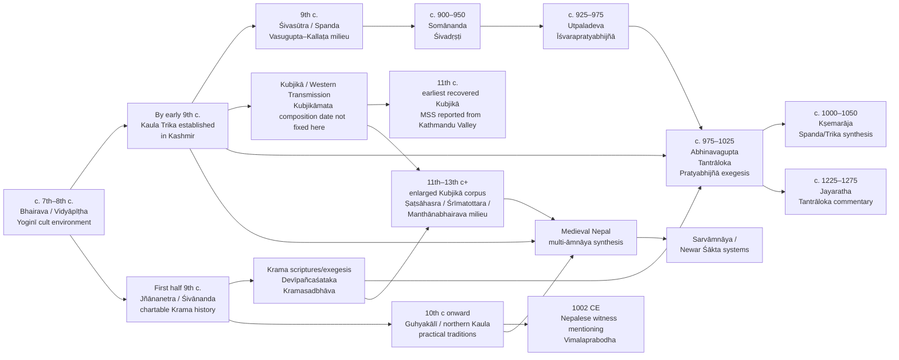
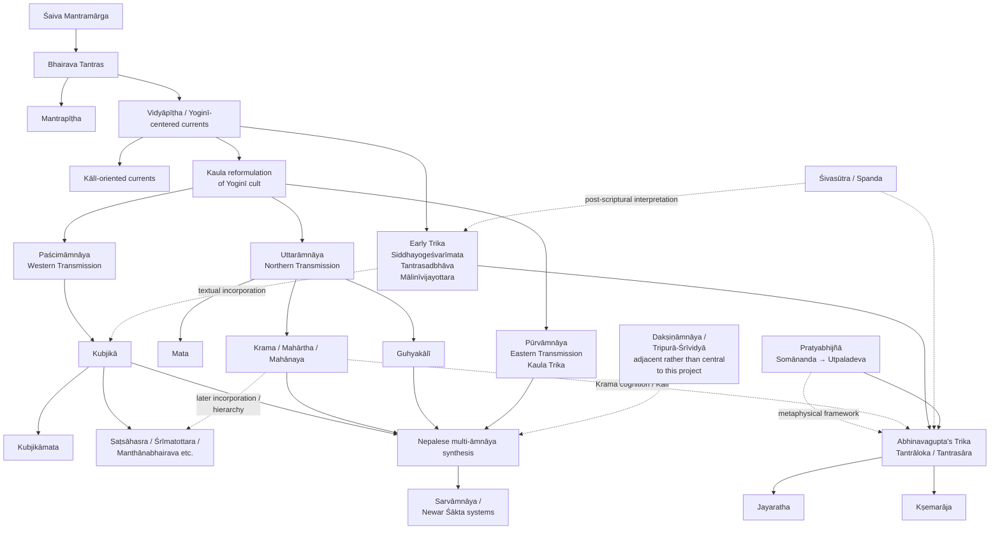
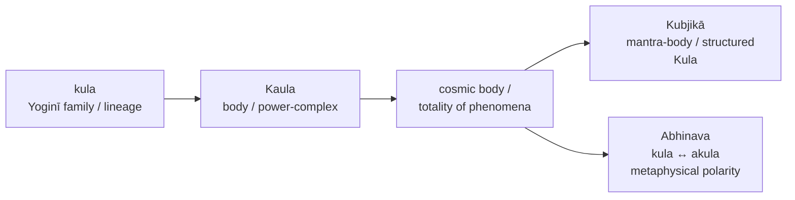
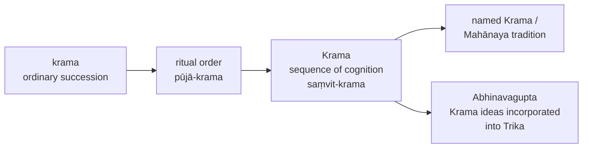
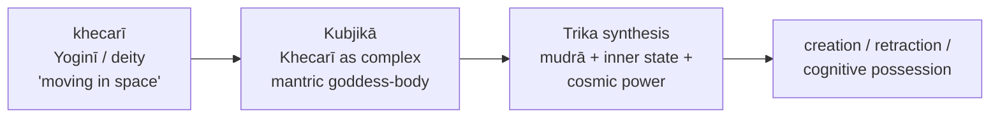
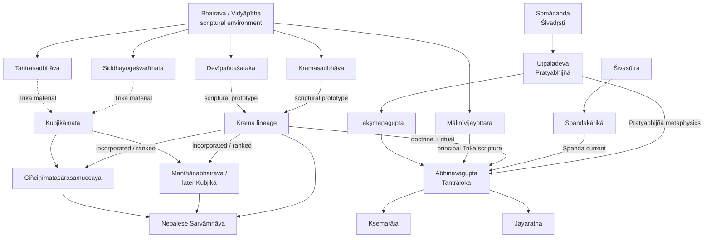
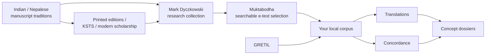
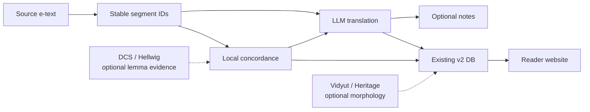

# Canonical Reference Map for the Trika–Krama–Kubjikā–Kaula–Pratyabhijñā–Sarvāmnāya Ecosystem

## Executive summary

The most useful way to model the territory you are entering is **not as six separate schools and not as one monolithic “Kashmir Śaivism.”** It is better understood as a historically changing network of scriptural cults, Kaula reformulations, philosophical/exegetical systems, and later syntheses. Alexis Sanderson's reconstruction is particularly important here: the Trika belongs to the Śaiva Mantramārga's Bhairava/Vidyāpīṭha environment; Kaulism developed within the Yoginī cults; the Krama became a highly internalized Kālī-oriented system; the Kubjikā tradition developed as the Western Transmission while extensively incorporating Trika material; and the philosophical systems of Spanda and Pratyabhijñā supplied concepts that Kashmiri exegetes—above all Abhinavagupta—used to reinterpret the scriptural traditions. citeturn15view2turn16view2turn16view4

The most important methodological conclusion is therefore:

> **Do not construct a single “Tantric dictionary.” Construct an evidence graph in which a lemma has different senses in different texts, periods, and traditions.**

Your canonical unit should be approximately:

```text
lemma
    ↓
textual occurrence
    ↓
local translation
    ↓
tradition
    ↓
date range
    ↓
sense
    ↓
parallel passages
    ↓
later reinterpretations
```

That is particularly necessary for words such as *kula*, *krama*, *śakti*, *visarga*, *spanda*, *khecarī*, *vimarśa*, and *anuttara*. Sanderson demonstrates, for example, that *kula* first refers to Yoginī/Mother families or lineages and that Kaulism then deliberately develops another sense involving the body, power, and ultimately the totality of phenomena. Abhinavagupta subsequently constructs sophisticated metaphysics with the *kula/akula* vocabulary. citeturn15view2turn16view2turn20view1

The historical center of gravity for your project is roughly the **ninth through thirteenth centuries**, particularly Kashmir, with important traditions attributing origins to places such as Oḍḍiyāna, followed by extremely important preservation and synthesis in Nepal. Sanderson places the chartable history of the Krama with Jñānanetra/Śivānanda in the first half of the ninth century; Somānanda and Utpaladeva initiate the classical Pratyabhijñā trajectory around the turn of the tenth century; Abhinavagupta flourishes around the late tenth–early eleventh century; and Jayaratha represents a later thirteenth-century exegetical culmination. Nepal is indispensable because it preserves practical and scriptural material otherwise lost, including Kubjikā and northern/Kālī traditions. citeturn16view3turn16view4turn15view2

For your actual translation project, the highest-return corpus is not simply “everything untranslated.” I recommend a **concentric ingestion order**:

**Trika/Spanda/Pratyabhijñā anchors → Krama/Kālīkula → Kubjikā root corpus → cross-āmnāya bridge works → large Yāmala/Manthāna materials → Nepalese Sarvāmnāya ritual syntheses.**

This closely mirrors Dyczkowski's own curatorial logic at Muktabodha. Muktabodha states that from 2004 to 2018 he selected its searchable e-texts in “ever expanding circles” intended to provide an overview of the wider Tantric literature, while deliberately creating specialist concentrations such as ritual manuals and Kubjikā. The library now reports more than 570 searchable e-texts, including more than 380 texts edited from manuscripts under his supervision. citeturn17search3

For infrastructure, you need much less than a conventional digital-humanities project. **Bilara's immutable segment-ID model + your existing database + a local concordance + optional Vidyut morphology** is enough. Bilara demonstrates that root text, translation, comment, variant, and other information can simply be stored as separate “cognate” data keyed to the same permanent segment ID. citeturn18view3

The canonical reference should therefore have five levels of authority:

| Level | What it records | Canonical status |
|---|---|---|
| Source | Sanskrit as found in an identified edition/e-text/manuscript | Immutable snapshot |
| Passage | Stable segment ID | Immutable identifier |
| Translation | Your present best rendering | Versioned, revisable |
| Sense | “What *kula* means here” | Evidence-backed hypothesis |
| Synthesis | “How *kula* evolved across traditions” | Versioned scholarly reconstruction |

A number such as “87% translation confidence” should **not** be part of the system. A defensible audit trail instead records whether the source has been verified, whether a parallel actually exists, whether morphology has been mechanically checked, and whether competing interpretations have been recorded.

Most importantly, there was **never a single historical canon jointly recognized by all of Trika, Krama, Kubjikā, Kaula and Pratyabhijñā**. “Canonical” should mean **canonical for your reference system: versioned, sourced, reproducible and falsifiable**, not that you have reconstructed an imagined unified sect.

## Historical map and taxonomy

### The compact timeline

The dates below distinguish, where possible, between the **historical activity of authors/traditions**, the **probable existence of texts**, and the **date of surviving manuscript witnesses**. These are not interchangeable. Where the evidence assembled here does not support a tighter date, I mark it as unspecified rather than manufacturing precision.



The early framework is the Bhairava-tantric world. Sanderson distinguishes its Mantrapīṭha and Vidyāpīṭha, with the latter focused especially on Yoginī-centered revelation. Within this environment he places Trika scriptures including the *Siddhayogeśvarīmata*, *Tantrasadbhāva* and *Mālinīvijayottara*. citeturn15view2

By the beginning of the ninth century, Kaula Trika was established in Kashmir; Sanderson identifies it with the Eastern Transmission (*Pūrvāmnāya*) in the developed Kaula classification. The chartable history of the Krama begins in the first half of the ninth century with Jñānanetra, also called Śivānanda, whose lineage traditions connect him with Oḍḍiyāna. The *Devīpañcaśataka* and *Kramasadbhāva* are especially important scriptural prototypes for the subsequent Krama ritual and contemplative system. citeturn16view4

The ninth century also sees the development of what scholarship calls the Spanda current around the *Śivasūtra* and *Spandakārikā*. Sanderson emphasizes that Spanda and Pratyabhijñā are **post-scriptural doctrinal developments** rather than simply additional revealed tantric sects. The surviving *Spandakārikā* describes Śiva as the source of the wheel of powers, speaks explicitly of *spandatattva*, and locates *spanda* in heightened experiential states. citeturn20view4

Somānanda's *Śivadṛṣṭi*, around the early tenth century, opens the second major philosophical stage; Utpaladeva develops the classical Pratyabhijñā system, and Abhinavagupta subsequently comments upon and integrates it. This is an important taxonomy point: **Pratyabhijñā is best represented in your map as a philosophical/exegetical current intersecting Trika, not as another directional Kaula āmnāya.** Abhinavagupta's *Tantrāloka* itself explicitly honors Somānanda and Utpaladeva and then names Lakṣmaṇagupta as his teacher. citeturn20view0

Abhinavagupta's mature Trika is not simply a commentary on one early cult. Sanderson describes a sequence in which the older cult of the three Trika goddesses was assimilated to Kālī systems and then philosophically reconstructed on Pratyabhijñā foundations. His concentrated worship of Parā as the solitary heroine (*Ekavīrā*) could itself be called *Anuttara*. citeturn16view4

The Kubjikā tradition belongs to the Western Transmission (*Paścimāmnāya*). It should not be represented as an isolated sister-school that independently invented a parallel system. Sanderson describes it as intimately connected to Trika and notes that substantial portions of the *Kubjikāmata* rework Trika material while embedding it in a newly constituted deity, mantra, yoga and ritual system. Dyczkowski likewise stresses the importance of Nepal for the transmission: he reports that virtually all manuscripts he consulted were Nepalese or descendants of Nepalese originals, with the earliest recovered examples copied in the Kathmandu Valley in the eleventh century. citeturn16view1turn15view2

Nepal then becomes more than a passive archive. Northern Kālī/Guhyakālī and Western Kubjikā traditions continued there in practical ritual environments. Sanderson identifies a Nepalese manuscript dated 1002 CE as the earliest datable evidence mentioning Vimalaprabodha, author of the *Kālīkulakramārcana*, and describes related practical literature continuing in the valley. citeturn16view3

### Taxonomy of the ecosystem

The following map is intentionally **not a strict genealogical tree**. Solid arrows mean historical/scriptural development or strong dependence; dotted conceptual relations mean influence, incorporation or reinterpretation.



This classification captures an important distinction in Sanderson's evidence. “Kaula” is not simply another box alongside “Trika” and “Kubjikā.” Kaulism develops inside the Yoginī cult environment and then generates directional transmissions and multiple esoteric reinterpretations. The Northern current includes Mata, Krama/Mahārtha/Mahānaya and Guhyakālī forms, whereas Kubjikā becomes the Western Transmission and Kaula Trika the Eastern one. citeturn16view2turn16view3

A useful website presentation would consequently classify each entity by **type**:

| Entity | What it principally is | Do not flatten it into |
|---|---|---|
| Trika | Scriptural cult + later Kaula and philosophical synthesis | “Kashmir Śaivism” as a whole |
| Krama | Kālī-oriented ritual/contemplative lineage and textual tradition | Generic *krama* = “sequence” |
| Kubjikā | Western-transmission Kaula tradition | A branch invented by Abhinavagupta |
| Kaula | Larger reformulation/ritual culture containing multiple transmissions | One single sect |
| Spanda | Post-scriptural doctrinal/experiential current | A directional Kaula āmnāya |
| Pratyabhijñā | Philosophical system of recognition | A Tantra or goddess cult |
| Sarvāmnāya | Later synthesis of multiple transmissions, especially important in Nepal | Ancient parent tradition of all the above |

That distinction is central to keeping the site's map historically intelligible. citeturn15view2turn16view2turn16view4

## Canonical corpus, geography, and surviving witnesses

### Texts that define the reference system

I would divide the corpus into **anchors**, **expansion texts**, and **frontier texts**. An anchor is not necessarily the “most authentic” text; it is one whose Sanskrit, historical relation, edition, commentary or translation gives you enough control to interpret neighboring material.

| Text / corpus | Current classification | Approx. historical position | Center / transmission | Digital status relevant to you | Manuscript / edition note | Ingestion priority |
|---|---|---|---|---|---|---:|
| *Mālinīvijayottaratantra* | Early/mature Trika scripture | Before Abhinavagupta; exact date here unspecified | Strong Kashmiri exegetical reception | Verify exact local e-text | Principal scriptural basis of Abhinava's Trika in Sanderson's reconstruction | **A+** |
| *Tantrasadbhāva* | Early Trika/Vidyāpīṭha | Pre-Abhinava | Kashmir / wider Mantramārga | Muktabodha/local status to verify | Important early Trika witness | **A** |
| *Siddhayogeśvarīmata* | Early Trika | Pre-Abhinava | Kashmir reception | Manuscript/edition availability to verify | One of Sanderson's earliest Trika strata | **A** |
| *Spandakārikā* | Spanda | Ninth-century milieu | Kashmir | GRETIL e-text confirmed | Attribution historically associated with Vasugupta/Kallaṭa milieu; GRETIL itself marks “Vasugupta (?)” | **A+** |
| *Śivadṛṣṭi* | Proto-/early Pratyabhijñā | Somānanda, c. early 10th c | Kashmir | Verify | Philosophical predecessor to Utpaladeva | **A** |
| *Īśvarapratyabhijñākārikā* + *Vṛtti* | Pratyabhijñā | Utpaladeva, 10th c | Kashmir | Critical editions/transcriptions exist; local status verify | Core philosophical control corpus | **A+** |
| *Tantrāloka* + Jayaratha | Trika synthesis | Abhinava c. 975–1025; Jayaratha c. 1225–1275 | Kashmir | **GRETIL confirmed** | GRETIL based on KSTS edition | **A+ reference**, not necessarily first full translation |
| *Parātriṃśikā* + Abhinava | Trika / phonemic metaphysics | Pre-Abhinava scripture + later exegesis | Kashmir | GRETIL confirmed | Excellent bridge between mantra, phonemes and metaphysics | **A+** |
| *Kramasadbhāva* | Krama | Scriptural prototype predating mature exegesis | Krama / Kashmir reception | Muktabodha/virtual archive e-text reported | Major Krama source used in reconstruction of ritual/cognition | **A+** |
| *Devīpañcaśataka* / *Kālīkulapañcaśatikā* | Krama/Kālīkula | Early Krama prototype | Northern transmission | Muktabodha e-text reported | One of Sanderson's two principal Krama prototypes | **A+** |
| *Mahānayaprakāśa* corpus | Krama/Mahānaya | Post-scriptural Krama | Kashmir and later transmission | Dyczkowski/Muktabodha material reported | Multiple works/authors, therefore keep witnesses separate | **A** |
| *Kubjikāmatatantra* | Kubjikā / Western Transmission | Pre-eleventh-century manuscript witnesses; exact composition date not fixed here | Nepalese preservation; Indian origin | **GRETIL confirmed** | GRETIL based on Goudriaan–Schoterman edition; earliest recovered MSS reported by Dyczkowski as 11th-c. Kathmandu Valley | **A+** |
| *Ṣaṭsāhasrasaṃhitā* | Expanded Kubjikā | Later than/rooted in KMT environment | Strong Nepalese transmission | Verify local Muktabodha copy | Important expansion of Kubjikā doctrinal/ritual vocabulary | **A** |
| *Śrīmatottara* | Kubjikā | Later Kubjikā development | Nepalese manuscript ecology | Verify local copy | Dyczkowski explicitly used manuscript material in his Kubjikā studies | **A** |
| *Ciñciṇīmatasārasamuccaya* | Mata / Kubjikā-associated multi-current bridge | Medieval; exact date unspecified here | Northern/Western currents, Nepalese preservation | Verify local Muktabodha transcription | Exceptionally valuable for cross-āmnāya mappings | **A+** |
| *Manthānabhairavatantra* | Mature Kubjikā/Western transmission | Later medieval Kubjikā | Nepalese preservation | Dyczkowski edition/study; local text status verify | Dyczkowski reports four sections totaling at least c. 22,000 ślokas | **B**, because enormous |
| *Jayadrathayāmala* | Vidyāpīṭha/Kālī-oriented Bhairava | Pre-/early medieval source layers | Wider northern Śaiva world | Fragmentary/manuscript/edition landscape | Fundamental but difficult and text-critically expensive | **B** |
| *Kālīkulakramārcana* | Guhyakālī practical manual | Medieval; author Vimalaprabodha attested by 1002 CE | Nepal | Witnesses / editions require verification | Major concrete bridge from doctrine into actual ritual procedure | **B+** |
| Newar multi-āmnāya paddhatis | Sarvāmnāya | Mainly later medieval/early modern strata | Kathmandu Valley | Large manuscript reservoir; uneven e-text availability | Treat each manuscript separately | **C initially; A later** |

The Trika/Krama chronology and relationships in this table follow Sanderson's reconstruction rather than treating later Kashmiri doctrine as the original meaning of every scripture. citeturn16view4turn15view2 The Kubjikā witness history follows Dyczkowski's report that the earliest recovered manuscripts known to him were copied in the Kathmandu Valley in the eleventh century. citeturn16view1 The GRETIL *Kubjikāmata* explicitly identifies itself as the *śrīkubjikāmata* within the *kulālikāmnāya* and gives stable chapter/verse numbering, making it especially attractive for your first serious aligned corpus. citeturn20view2turn22view3

The GRETIL *Tantrāloka* is similarly valuable because its electronic text retains verse addresses. Its opening already exposes the synthesis you are trying to map: *anuttara*, *kula*, *visarga*, *svātantryaśakti*, *krama*, Somānanda, Utpaladeva and Lakṣmaṇagupta all occur in the first eleven verses. citeturn20view0

### Geographic centers should be nodes, not decorative metadata

Your website should separately represent **claimed place of revelation**, **historically attested center of interpretation**, and **place where manuscripts survive**. They can be very different.

```text
OḌḌIYĀNA / SWAT
    │
    └─ tradition memories surrounding northern Kālī / Krama lineages
                     │
                     ▼
KASHMIR ───────────────────────────────────────────────┐
    │                                                  │
    ├─ Trika                                            │
    ├─ Krama exegesis                                   │
    ├─ Spanda                                           │
    ├─ Somānanda → Utpaladeva → Abhinavagupta          │
    └─ Jayaratha                                        │
                                                       │
                                                       ▼
                                          PAN-INDIAN TRANSMISSION

NEPAL / KATHMANDU VALLEY
    │
    ├─ preservation of Kubjikā manuscripts
    ├─ preservation of Guhyakālī / northern materials
    ├─ Newar ritual continuity
    └─ later multi-āmnāya / Sarvāmnāya synthesis
```

Sanderson notes that traditions surrounding Krama associate Jñānanetra's revelation with Oḍḍiyāna but warns that the origins of most Tantras cannot simply be geographically fixed. His evidence for Kashmir is much stronger at the level of exegetes and identifiable lineages than for the place of composition of every scripture. citeturn16view3turn16view4 This distinction should become a formal metadata field:

```json
{
  "claimed_revelation_place": "Oḍḍiyāna",
  "historical_center": "Kashmir",
  "witness_location": "Kathmandu Valley",
  "certainty": {
    "claimed_revelation_place": "traditional attribution",
    "historical_center": "strong",
    "witness_location": "manuscript evidence"
  }
}
```

That is much more useful than a single `location = Kashmir` property.

## Canonical glossary and semantic-shift atlas

### The glossary data model

Do **not** define:

```text
kula = family
krama = sequence
spanda = vibration
vimarśa = reflection
```

Define:

```text
LEMMA
  └── SENSE
       ├── tradition
       ├── period
       ├── textual locus
       ├── translation adopted
       ├── semantic explanation
       ├── parallel loci
       └── status
```

A minimal record could be:

```json
{
  "lemma": "kula",
  "sense_id": "kula.trika.abhinava.01",
  "tradition": "Trika",
  "period": "c. 1000 CE",
  "sense": "manifest or dynamic pole of the Kaula totality",
  "translation_policy": "usually retain as Kula in technical contexts",
  "evidence": [
    "TA.1.1",
    "TA.3.143"
  ],
  "status": "working",
  "note": "Must be interpreted in relation to akula and kaulikī śakti."
}
```

### Core glossary

The following is a **reference seed**, not a declaration that each word has only these senses.

| Lemma | Tradition / period | Working sense | Primary evidence | Semantic warning |
|---|---|---|---|---|
| **kula** | Early Yoginī/Kaula | Family/lineage of Yoginīs or Mothers | Sanderson's reconstruction from Vidyāpīṭha sources | This is historically important and should not be erased by later metaphysical translations. citeturn15view2turn16view2 |
| **kula** | Developed Kaula | Body; “body”/totality of power and phenomena | Kaula reinterpretation documented by Sanderson | An intentional semantic expansion from lineage to body/power/totality. citeturn16view2 |
| **kula** | Kubjikā | Mantric/cosmic body; structured aggregate | KMT 17.80–82 calls Khecarī/Mālinī a *mantradeha* and the resulting body *kulātmaka* | Avoid automatically translating “family.” citeturn22view0turn22view3 |
| **akula** | Abhinava/Trika | Supreme/transcendent pole, explicitly identified with *anuttara* | TĀ 3.143 | Best understood relationally with *kula*. citeturn20view1 |
| **krama** | General Sanskrit / ritual | Order, succession, sequence, method | Numerous contexts | Do not infer “Krama school” from the noun alone. |
| **krama** | Krama/Kālīkula | Ordered unfolding of cognition reflected in ordered worship | Sanderson: *pūjākrama* reflects *saṃvitkrama* | Here sequence is simultaneously ritual and phenomenological. citeturn15view2turn16view4 |
| **krama** | Abhinava/Trika | Sequence, progressive manifestation, or graduated procedure | TĀ 1.5; numerous later chapters | Sometimes generic; sometimes carrying inherited Krama resonance. citeturn20view0 |
| **śakti** | Spanda | Power/dynamism constitutive of manifestation and cognition | SPK 1, 18–19 | Not merely “energy.” citeturn20view4 |
| **śakti** | Kubjikā | Goddess/mantric power, with strong phonemic and triadic articulation | KMT 1.71–81; 2.1; 4.110 | Deity, language and causal power overlap rather than form separate categories. citeturn22view3 |
| **śakti** | Abhinava/Trika | Freedom/power of consciousness; specific powers differentiated from and reintegrated into supreme awareness | TĀ 1.5; 3.143–44; 33.20–29 | Translate by context; a single English “energy” seriously impoverishes it. citeturn20view0turn20view1turn21view3 |
| **spanda** | Spanda tradition | Dynamic pulse/activity of the fundamental conscious reality | SPK 19, 21–22 | “Vibration” is conventional but risks sounding mechanically physical. citeturn20view4 |
| **vimarśa** | Pratyabhijñā/Abhinava | Reflexive apprehension, self-awareness, consciousness's capacity to apprehend itself and its content | TĀ 3 and 33; Abhinava's Pratyabhijñā context | “Reflection” alone can falsely imply discursive thought. citeturn11search0turn21view3 |
| **parāmarśa** | Pratyabhijñā/Trika | Apprehension/self-apprehension, often the act by which experience is gathered into a unified awareness | TĀ 33.20–29 | Related to but not always interchangeable with *vimarśa*. citeturn21view3 |
| **prakāśa** | Trika/Pratyabhijñā | Manifest luminosity; awareness as that in virtue of which things appear | TĀ 3.133 etc. | “Light” is metaphorically suggestive but can mislead if treated as physical luminosity. citeturn20view1 |
| **visarga** | Trika/Kaula | Emission, release, manifestation; power by which the supreme projects/expresses itself | TĀ 3.141–46 | Carries phonemic, cosmological and in some contexts erotic/ritual resonances. citeturn20view1 |
| **anuttara** | Mature Trika | The unsurpassed/ultimate; concentrated Parā/Ekavīrā and supreme state | TĀ 1.1, 1.5; 3.143 | Not merely the adjective “highest.” It becomes a highly loaded technical designation. citeturn20view0turn20view1turn16view4 |
| **khecarī** | Kubjikā | Goddess/power associated with the “sky/space,” mantra-body, Mālinī and structured divine body | KMT 17.77–82 | Not reducible to the later Haṭhayogic tongue gesture. citeturn22view0 |
| **khecarī** | Abhinava's ritual synthesis | Mudrā, internal condition/power, movement through space, creation/retraction, possession by the goddess | TĀ 32.31–65 | An excellent test case for polysemy within one chapter. citeturn21view3 |
| **saṃvit** | Krama | Conscious awareness considered in dynamic sequence | *saṃvitkrama* in Sanderson's reconstruction | Essential for understanding why ritual order can model cognition. citeturn15view2 |
| **svātantrya** | Spanda/Pratyabhijñā/Trika | Inherent autonomy/freedom of conscious agency | SPK 7; TĀ 1.5 | “Free will” is too narrow; this is ontological efficacy as well as volition. citeturn20view4turn20view0 |
| **Mālinī** | Trika/Kubjikā | Goddess/phonemic arrangement/power of mantra-language | KMT 1.71–81, 4.107–110; TĀ's Mālinī-oriented system | Keep deity, alphabet and mantra ontology connected. citeturn22view3 |
| **mātṛkā** | Mantric Śaiva-Śākta usage | Mother/phonemic matrix, power embodied in letters | KMT 4.110 explicitly identifies Śakti with Mātṛkā and Mātṛkā as Śiva-natured | An obvious candidate for a cross-text phonemic dossier. citeturn22view3 |
| **saṃhāra / saṃhṛti** | Spanda/Trika/Kubjikā | Retraction, withdrawal, dissolution | SPK 6; TĀ 32.46, 59 | Context ranges from cosmic process to ritual/internalized operation. citeturn20view4turn21view3 |
| **pratyabhijñā** | Utpaladeva/Abhinava | Recognition of one's identity/nature as the autonomous conscious principle | Utpaladeva's philosophical corpus; adopted as metaphysical foundation of Abhinava's Trika | Do not treat “recognition” as mere recollection. Sanderson explicitly identifies Pratyabhijñā concepts as the metaphysical groundwork for Abhinava's ritual. citeturn16view4 |

### Semantic shifts worth making first-class objects

A concept page should not merely show definitions. It should show the **trajectory**:



The first transition is especially secure because Sanderson explicitly identifies the deliberate Kaula homonym: the older Yoginī-family sense remained, while *kula* also came to designate body and then the totality or “body” of Śakti. citeturn16view2 The Kubjikā text itself later describes a *mantradeha* whose components form a *kulātmaka* body. citeturn22view0 Abhinava can then say straightforwardly that the supreme *anuttara* domain is *akula*, while *visarga* is its *kaulikī śakti*. citeturn20view1

A second trajectory:



The critical transformation is when ritual sequence becomes an enactment or reflection of the ever-present sequence of cognition. Sanderson describes precisely this relation: the *pūjākrama* is understood as a reflection of the *saṃvitkrama*. citeturn15view2turn16view4

A third:



The *Kubjikāmata* presents Khecarī as a sixteen-part goddess, Mālinī, *mantradeha* and *kulātmaka* body. citeturn22view0 In *Tantrāloka* chapter 32, the same semantic field expands dramatically: *khecarī* can name procedures, mudrās and internal states; creation and retraction are attributed to her, and possession by Śrī Khecarī is said to yield the supreme seed. citeturn21view3

### Sample concept dossier: *kula*

**Core historical problem:** Does *kula* mean lineage, body, power, totality, a religious system, or some combination?

**Early evidential layer.** In the Yoginī cult environment, Yoginīs belong to maternal “families” (*kula*) or lineages (*gotra*). This gives the term an actual socio-mythic classificatory function rather than an abstract metaphysical one. citeturn15view2

**Kaula transition.** Kaulism preserves that meaning but deliberately extends the homonym toward the body and ultimately the “body” or totality of Śakti/phenomena. This is one of the clearest semantic transformations in the whole ecosystem. citeturn16view2

**Kubjikā layer.** KMT 1.1 already juxtaposes *akula* and *kula* in an extraordinarily compressed cosmological verse. KMT 17.77–82 later gives a much more concrete deployment in which the goddess's phonemic/mantric components constitute a divine *deha* that is *kulātmaka*. citeturn20view2turn22view0

**Abhinava layer.** TĀ 3.143 explicitly identifies the supreme *anuttara* abode with *akula* and its *visarga* with *kaulikī śakti*. This is no longer adequately represented by “clan/not-clan.” citeturn20view1

**Working translation policy:** retain **Kula** when the entire technical system is activated; translate “family/lineage” when the concrete Yoginī classification is dominant; use “aggregate/body/complex” only where the passage itself supports that sense.

**Research question generated:** how much of Abhinava's *kula/akula* metaphysics is already structurally present in earlier Kaula scripture, and how much is philosophical reorganization?

### Sample concept dossier: *krama*

**Ordinary layer:** sequence/order/procedure.

**Krama layer:** sequence becomes the defining architecture of the Kālī tradition. Sanderson describes the system as making the perceptible order of worship correspond to the imperceptible sequence of cognition. citeturn16view4

**Trika synthesis:** TĀ 1.5 places *krama* beside *svātantryaśakti* in its opening characterization of the supreme's powers. That alone warns against translating every occurrence as a mechanically external sequence. citeturn20view0

**Kubjikā layer:** KMT itself freely uses *krama* in more procedural senses as well as in highly technical compounds; therefore “Krama” should only be capitalized when lineage/doctrinal evidence establishes the reference. The very first KMT verse already contains *kramapada* alongside *ānandaśakti* and *akula/kula*, showing that the lexical environments interpenetrate. citeturn20view2

**Working translation policy:** sequence / succession / ordered process; “Krama” only when sectarian identity is demonstrable.

### Sample concept dossier: *visarga*

**Base semantic field:** emission, sending forth, release; also the grammatical sign/phoneme *ḥ*.

**Abhinava's transformation:** TĀ 3.141 describes creation and retraction as manifestations of the Lord's *visarga*. TĀ 3.143 calls it the supreme's *kaulikī śakti*, and 3.144 links it with the progressive emergence of *kriyāśakti*. The surrounding verses explicitly interlace cosmology, phonemics, desire and Kaula terminology. citeturn20view1

**Translation implication:** “emission” is often the safest literal anchor, but your commentary should separately tag:

```text
VISARGA
├─ grammatical/phonemic
├─ cosmogenic manifestation
├─ Kaula power
├─ breath/prāṇic
├─ ritual
└─ erotic/sexual context
```

This is exactly why lemma-level translation consistency by itself is not desirable. **Semantic consistency is the goal, not lexical uniformity.**

## Influence, citation, and modern selection effects

### Historical influence graph

The graph should distinguish four edge types:

```text
CITES            direct textual citation
BORROWS          demonstrable textual dependence
INTERPRETS       later conceptual/exegetical reading
SYNTHESIZES      deliberate combination of systems
```

A first-pass graph would look like this:



This graph is intentionally asymmetric. The mature Trika of Abhinavagupta is a **recipient of several earlier streams** rather than the source from which they all descend. Sanderson describes his system as based particularly on the *Mālinīvijayottara*, philosophically grounded in Utpaladeva's Recognition system, and profoundly influenced by Krama. citeturn16view4

The primary text confirms the philosophical lineage explicitly: TĀ 1.10 praises Somānanda and Utpala; 1.11 names Lakṣmaṇagupta. citeturn20view0

The Kubjikā relationship must likewise be represented with directed borrowing edges. Sanderson's reconstruction holds that the Western tradition incorporated Trika material and that parts of the *Kubjikāmata* are close reworkings of the earlier Trika corpus. Later Western-tradition works then go further by appropriating and hierarchizing Krama. citeturn15view2

### The Abhinavagupta effect

Abhinavagupta should be represented on your site as a **major synthesis node, not a transparent witness to all earlier Tantra**.

A useful visual device would be:

```text
EARLIER SCRIPTURES                         ABHINAVA
─────────────────                         ────────
Trika triad ─────────────────────────────┐
                                        │
Krama/Kālī cognition ───────────────────┼──► integrated Trika
                                        │
Kaula practice ─────────────────────────┤
                                        │
Pratyabhijñā metaphysics ───────────────┤
                                        │
Spanda language ────────────────────────┘
```

Sanderson explicitly distinguishes at least three phases of Trika: early Trika centered on the three goddesses; a Kālī-inflected Trika; and Abhinava's Pratyabhijñā-based synthesis, including both Kālī-oriented and concentrated Parā/Ekavīrā forms. citeturn16view4

That means every commentary generated from your corpus should eventually be capable of saying:

> “This is an earlier scriptural use. Abhinavagupta later interprets a related expression as X.”

rather than:

> “This verse means X because Abhinavagupta says so.”

### The Dyczkowski effect

Dyczkowski belongs in a **modern reception/curation graph**, separate from historical influence:



Muktabodha states unusually clearly how this selection took place: Dyczkowski served as academic advisor from 2004 to 2018, chose the searchable e-texts, selected them in progressively expanding circles to cover tantric literature, deliberately included specialist collections such as Kubjikā and Hindu ritual manuals, and trained the transcription team to read scripts including Newari. citeturn17search3

This is an enormous advantage for your project—but it produces a **selection effect**.

For example, suppose your corpus search yields:

```text
Kubjikā            4,000 occurrences
Śrīvidyā           2,300
Trika              7,000
...
```

You must not conclude:

> “Kubjikā was historically twice as influential as Śrīvidyā.”

You can conclude:

> “Kubjikā is unusually well represented in this particular expert-curated corpus.”

That distinction should be built into the site's statistics.

Muktabodha itself now reports more than 3,000 digitized texts and more than 570 searchable e-texts; more than 380 of the searchable works were edited from manuscripts under Dyczkowski's supervision. It also incorporated more than 2,000 primarily Śaiva Siddhānta items through collaboration with the French Institute of Pondicherry. citeturn17search3

## Auditable translation corpus and minimal tooling

### The architecture I would actually use

Given the repository you described, **do not migrate everything into Ambuda or reinvent Bilara**.

Your current system already has the right conceptual entities. Reduce the working pipeline to:



The core principle borrowed from Bilara is excellent: every segment has an immutable ID; root text, translation, commentary and variants are separate data keyed by the same ID. Bilara's actual repository uses JSON objects in which the key is a unique segment identifier, maintains root/translation/comment/variant as separate cognate files, and treats the segment IDs as immutable even when display files are reorganized. citeturn18view3

So your canonical public representation can remain almost absurdly simple:

```json
{
  "KMT.17.77": {
    "root": "ṣoḍaśāvayavā devī khecarī tu khageśvarī ...",
    "translation": "The sixteen-part Goddess is Khecarī, Mistress of Space ...",
    "notes": [
      "khecarī retained because this is a technical goddess-name."
    ],
    "source": "Goudriaan-Schoterman/GRETIL",
    "source_sha256": "...",
    "translation_revision": 3
  }
}
```

The Sanskrit verse is actually attested as KMT 17.77 in the GRETIL edition, immediately followed by the Mālinī/mantra-body construction in 17.80–82. citeturn22view0

### What “auditable” needs to mean

You do not need peer-reviewed certainty on every sentence. You need recoverability:

```text
Can I recover exactly which Sanskrit was translated?       YES
Can I identify the edition/e-text it came from?             YES
Can I recover the previous translation?                     YES
Can I see why an unusual technical rendering was selected?  WHEN NEEDED
Can I verify a claimed parallel actually exists?            YES
Can a human propose a better translation?                   YES
```

That is enough for your stated purpose: exploratory but serious translations of a large corpus.

Use statuses such as:

```text
source_verified
parallel_verified
morphology_checked
reviewed
disputed
text_uncertain
```

Do **not** combine them into:

```text
confidence = 87.4%
```

unless you later obtain an actual calibrated validation dataset.

### The concordance is the highest-value script

Because you already have hundreds of local texts, the first tool should be a local full-text index.

For v1, **do not even require a Sanskrit lemmatizer**. Normalize Unicode and index words plus passage IDs.

A minimal implementation can use Python's standard library and SQLite FTS5:

```python
# build_concordance.py
from __future__ import annotations

import hashlib
import sqlite3
import unicodedata
from pathlib import Path

CORPUS = Path("sources")
DB = Path("data/concordance.sqlite3")

def normalize(text: str) -> str:
    # Preserve Sanskrit distinctions; only normalize Unicode/spacing.
    text = unicodedata.normalize("NFC", text)
    return " ".join(text.split())

def sha256(path: Path) -> str:
    h = hashlib.sha256()
    with path.open("rb") as f:
        for block in iter(lambda: f.read(1 << 20), b""):
            h.update(block)
    return h.hexdigest()

con = sqlite3.connect(DB)
con.executescript("""
CREATE TABLE IF NOT EXISTS passages (
    id INTEGER PRIMARY KEY,
    work TEXT NOT NULL,
    locator TEXT,
    text TEXT NOT NULL,
    source_path TEXT NOT NULL,
    source_hash TEXT NOT NULL
);

CREATE VIRTUAL TABLE IF NOT EXISTS passage_fts
USING fts5(text, content='passages', content_rowid='id');
""")

for path in CORPUS.rglob("*.txt"):
    work = path.stem
    source_hash = sha256(path)

    # Replace this with your corpus-specific verse splitter.
    for n, raw in enumerate(path.read_text("utf-8").splitlines(), 1):
        text = normalize(raw)
        if not text:
            continue

        cur = con.execute(
            """INSERT INTO passages
               (work, locator, text, source_path, source_hash)
               VALUES (?, ?, ?, ?, ?)""",
            (work, str(n), text, str(path), source_hash),
        )
        con.execute(
            "INSERT INTO passage_fts(rowid, text) VALUES (?, ?)",
            (cur.lastrowid, text),
        )

con.commit()
```

Then your translation prompt can retrieve:

```sql
SELECT work, locator, text
FROM passage_fts
JOIN passages ON passages.id = passage_fts.rowid
WHERE passage_fts MATCH 'visarga'
LIMIT 50;
```

Later add lemma-aware retrieval. **Only add it after exact/stem searching becomes a demonstrated bottleneck.**

### Ingest your existing translations second

Your described T1 Markdown already contains approximately what you need. Write one parser that extracts:

```text
work
chapter
verse
Sanskrit
translation
notes
flags
```

and maps them onto your existing `passages` and `translations` tables.

Conceptually:

```python
# ingest_t1.py
from pathlib import Path
import re

VERSE = re.compile(r"^##\s+(.+)$", re.M)

def parse_t1(path: Path):
    raw = path.read_text("utf-8")
    matches = list(VERSE.finditer(raw))

    for i, match in enumerate(matches):
        locator = match.group(1).strip()
        start = match.end()
        end = matches[i + 1].start() if i + 1 < len(matches) else len(raw)
        block = raw[start:end]

        # Adapt these to the exact headings you already use.
        source = extract_section(block, "Sanskrit")
        translation = extract_section(block, "Translation")
        notes = extract_section(block, "Notes")

        yield {
            "locator": locator,
            "source": source,
            "translation": translation,
            "notes": notes,
            "raw_markdown": block,
        }
```

The important bit is not the parser. It is what gets preserved alongside every ingest:

```text
source_file
source_hash
translation_file
translation_hash
model, if generated
generation timestamp
revision
```

Then Git and the database together give you both human-readable history and machine-queryable history.

### Morphology comes third

Vidyut is now a particularly attractive lightweight option because its Python package can be installed directly with `pip install vidyut`. Its `vidyut-cheda` component segments expressions and annotates them morphologically; other modules handle sandhi, transliteration, compact morphological dictionaries and Pāṇinian generation. citeturn18view1

The point is not to let Vidyut “approve” your translation. Store its analysis **alongside** yours:

```text
KMT.17.77
token: khecarī

translator:
    lemma = khecarī
    nominative singular feminine

vidyut:
    [analysis A, analysis B...]

heritage:
    [analysis...]

status:
    morphology_checked
```

Disagreement is useful information.

Sanskrit Heritage offers complementary lexical, morphological, segmentation and parsing infrastructure, so it can act as an independent second analysis layer where a passage matters. citeturn18view2

DCS should principally be treated as a **corpus-attestation resource**. The Digital Corpus of Sanskrit provides lemmatized and part-of-speech-tagged Sanskrit across genres, and Oliver Hellwig's associated GitHub repository provides downloadable linguistic data. citeturn19search0turn19search5

### Where Ambuda fits

Ambuda is valuable as an architectural reference and potential source of reusable components, not something you must migrate into. Its open-source application already integrates a Sanskrit reader, dictionary/analysis support, text uploading and a SQLite-backed development environment. citeturn18view4

Ambuda also provides downloadable text resources in formats including plain text, XML, PDFs and token data, and notes that much of its text corpus derives from GRETIL while its parse data uses a DCS snapshot. citeturn17search13

That makes the roles quite clear:

| Tool | Use now | Do **not** use it for |
|---|---|---|
| **Muktabodha** | Main specialist tantric source reservoir | Treating collection frequency as historical prevalence |
| **GRETIL** | Stable machine-readable editions/reference texts | Assuming every file is a new critical edition |
| **Your concordance** | Cross-text evidence | Sophisticated morphology at v1 |
| **Bilara model** | Stable segment addressing | Rebuilding your DB around Buddhist taxonomy |
| **Vidyut** | Optional segmentation/morphology | Deciding what tantric technical terms mean |
| **Sanskrit Heritage** | Second morphological/lexical opinion | Automatic doctrinal interpretation |
| **DCS/Hellwig** | Lemmas, morphology, general usage comparison | Treating generic Sanskrit senses as tantric senses |
| **Ambuda** | UI/data architecture inspiration and reusable Sanskrit tooling | Replacing your already-working translation corpus |

### Prioritized repositories and resources

These are the URLs I would actually pin into your project README.

**Primary specialist corpus**

http://muktabodha.org/digital-library/

Muktabodha's searchable collection is the most directly aligned with your subject because of its specialist Śaiva/Śākta concentration and Dyczkowski-supervised corpus. citeturn17search3

**GRETIL**

http://gretil.sub.uni-goettingen.de/

http://github.com/INDOLOGY/GRETIL-mirror

The GitHub mirror exists specifically for stability, traceability and archival security and contains Unicode snapshots; it notes that the corpus is also substantially represented in TEI/XML. citeturn17search1

**Kubjikāmata e-text**

http://gretil.sub.uni-goettingen.de/gretil/1_sanskr/4_rellit/saiva/kubjt_pu.htm

The GRETIL file is based on the Goudriaan–Schoterman edition and provides stable verse identifiers. citeturn20view2

**Tantrāloka e-text**

http://gretil.sub.uni-goettingen.de/gretil/1_sanskr/6_sastra/3_phil/saiva/tantralu.htm

It is especially useful as a searchable semantic cross-reference corpus rather than something you need to retranslate from beginning to end first. citeturn20view0

**Digital Corpus of Sanskrit**

http://www.sanskrit-linguistics.org/dcs/

http://github.com/OliverHellwig/sanskrit

The GitHub repository includes downloadable DCS-related data and is the natural external source when your own concordance eventually needs lemmatized/POS-tagged evidence. citeturn19search0turn19search5

**Vidyut**

http://github.com/ambuda-org/vidyut

Vidyut provides segmentation/morphology, sandhi, transliteration and Pāṇinian generation, with a Python package installable from PyPI. citeturn18view1

**Sanskrit Heritage**

http://sanskrit.inria.fr/

Use it as an independent morphological/lexical analysis system rather than as a foundation for the site. citeturn18view2

**Ambuda**

http://github.com/ambuda-org/ambuda

http://ambuda.org/

Its reader and data architecture are worth inspecting if you later want sophisticated Sanskrit word interaction. citeturn18view4

**Bilara**

http://github.com/suttacentral/bilara

http://github.com/suttacentral/bilara-data

The `bilara-data` repository is the clearest existing demonstration of immutable segment IDs linking source, translation, comments and variants while Git handles version history. citeturn18view3

### The ingestion sequence I recommend

The highest-value order is:

| Wave | Corpus | Why it comes here |
|---|---|---|
| **Semantic anchors** | *Tantrāloka*, *Spandakārikā*, *Parātriṃśikā*, *Mālinīvijayottara*, Pratyabhijñā selections | Establish technical vocabulary with unusually strong interpretive control |
| **Krama core** | *Kramasadbhāva*, *Devī/Kālīkulapañcaśatikā*, *Mahānayaprakāśa* | First strong test of whether Trika-derived senses survive outside Trika |
| **Kubjikā root** | *Kubjikāmata* | Excellent machine-readable scripture with rich Kaula/mantric vocabulary |
| **Kubjikā expansion** | *Ṣaṭsāhasra*, *Śrīmatottara*, *Kulālikāmnāyaratnoddyota* and cognates | Observe internal semantic development within one transmission |
| **Bridge layer** | *Ciñciṇīmatasārasamuccaya* | Detect explicit negotiation among transmissions |
| **Large syntheses** | *Manthānabhairava*, selected *Jayadrathayāmala* material | Exploit the semantic infrastructure after it is mature |
| **Sarvāmnāya** | Newar paddhatis and multi-directional ritual works | Test the model against traditions that deliberately combine earlier systems |

This sequence is an inference from the historical relations reconstructed above and from digital availability: you repeatedly move from a text with strong interpretive anchors into a neighboring but less-controlled corpus rather than jumping arbitrarily between traditions. citeturn16view4turn17search3turn20view2

## Roadmap to a versioned canonical reference

### Initial build phase

**Months one through two:** freeze the corpus substrate.

Do not translate hundreds of new texts yet. Take your existing translations and give every source passage a permanent identifier. Create a `works` manifest containing title, normalized title, tradition, provisional date range, editor/source, local path, source URL, source hash and provenance notes.

A good canonical manifest is:

```yaml
id: KMT
title: Kubjikāmatatantra
tradition:
  - Kubjikā
  - Paścimāmnāya
source:
  type: etext
  repository: GRETIL
  edition_basis: Goudriaan-Schoterman
  url: http://gretil.sub.uni-goettingen.de/gretil/1_sanskr/4_rellit/saiva/kubjt_pu.htm
dating:
  composition:
    value: unspecified
    status: unresolved
  earliest_known_witness:
    value: 11th century
    note: earliest recovered witnesses reported by Dyczkowski
geography:
  preservation:
    - Kathmandu Valley
```

The GRETIL edition basis is explicit in its file, while Dyczkowski reports the eleventh-century Kathmandu Valley manuscript evidence. citeturn20view2turn16view1

Deliverables at the end of this phase:

```text
works.yaml
passages table populated
existing T1 translations imported
source hashes frozen
build_concordance.py working
/search?q=kula working locally
```

### Corpus-learning phase

**Months three through five:** build the first real semantic corpus.

Focus on only perhaps **twenty to thirty high-value lemmas**:

```text
kula
akula
krama
śakti
spanda
saṃvit
vimarśa
parāmarśa
prakāśa
visarga
anuttara
khecarī
mālinī
mātṛkā
svātantrya
āveśa
samāveśa
uccāra
vyāpti
śūnya
saṃhāra
sṛṣṭi
cakra
mantra
```

For every one, collect the most informative passages in your currently available Trika, Krama and Kubjikā material.

Do **not** attempt to classify every occurrence immediately.

The result should look like:

```text
kula
  occurrences: 1,428

  manually classified:
      lineage/family       18
      body/aggregate       27
      technical Kula       54
      unclear              11

  key passages:
      ...
```

That is already enough to make a compelling website concept page.

At this point add `verify_parallels.py`: any translation note claiming “compare KMT 17.82” can mechanically check that the cited passage exists and store its source hash.

### Comparative translation phase

**Months six through nine:** make Krama and Kubjikā the main reading frontier.

Translate complete manageable works or coherent chapters rather than maximizing text count.

A particularly productive triangle is:

```text
KRAMASADBHĀVA
      ↘
       semantic comparison
      ↗
KUBJIKĀMATA ←→ TANTRĀLOKA
```

The reason is historical as well as practical. The Krama gives you the transformation of ritual sequence into cognition-sequence; the Kubjikā gives you a closely related but independently elaborated Kaula/Western system; and Abhinava gives you a sophisticated Kashmiri synthesis against which—but not through which exclusively—you can triangulate both. citeturn16view4turn20view2turn20view1

At the end of this phase the website should support:

```text
READ TEXT
COMPARE TRANSLATIONS
SHOW NOTES
SEARCH CORPUS
CLICK TECHNICAL TERM
SHOW OCCURRENCES BY TRADITION
```

Nothing more elaborate is required.

### Reconstruction phase

**Months nine through twelve:** begin producing the “decode the system” layer.

Do not ask the model to write free-floating explainers.

Make each explainer derive from a dossier:

```text
WHAT IS KULA?
├─ working reconstruction
├─ early Yoginī sense
├─ Kaula transformation
├─ Kubjikā usage
├─ Krama usage
├─ Abhinavagupta usage
├─ primary passages
├─ unresolved contradictions
└─ revision history
```

At that point your site can answer:

> **What is the Goddess?**

not with generic language about “divine feminine energy,” but with navigable evidence:

```text
GODDESS AS
├─ deity/person addressed in revelation
├─ Śakti / causal efficacy
├─ cognition
├─ sequence of cognition
├─ phonemic body
├─ mantra
├─ cosmic manifestation
├─ Yoginī network
├─ embodied ritual presence
└─ supreme nondual reality
```

The *Kubjikāmata* itself makes the value of this approach obvious. In its opening chapters Mālinī can simultaneously be Rudra's Śakti, the mass of phonemes, the origin of mantras, a goddess who speaks to Bhairava, a form of knowledge-power, and a power associated with desire and action. Those are not adequately described by choosing one English equivalent for *śakti*. citeturn22view3

### Expansion phase

**Months twelve through fifteen:** ingest bridge and synthesis texts.

Move seriously into:

```text
Ciñciṇīmatasārasamuccaya
Ṣaṭsāhasrasaṃhitā
Śrīmatottara
selected Manthānabhairava
Mahānayaprakāśa materials
```

This is when your concept dossiers become much more valuable than the initial Dyczkowski-based glossary. You will begin to see which distinctions are genuinely stable across the corpus and which were artifacts of starting from Trika.

Introduce morphology only where it actually helps.

A simple batch checker can eventually produce:

```text
KMT.17.82
translator lemma      analyzer
mālinī                 mālinī       AGREE
śabdarāśiḥ             śabdarāśi    AGREE
etad                    etad         AGREE
deham                   deha         AGREE
kulātmakam              kulātmaka    AGREE

status: morphology_checked
```

Vidyut's `cheda` module is explicitly designed for word segmentation and morphological annotation and is fast enough for interactive use. citeturn18view1

### Publication phase

**Months fifteen through eighteen:** freeze **Canonical Reference v1.0**.

The v1 release should contain:

**The library:** translated source texts with Sanskrit and stable passage IDs.

**The atlas:** tradition pages for Trika, Krama, Kubjikā, Kaula, Spanda, Pratyabhijñā and Sarvāmnāya.

**The timeline:** texts, authors, lineages, dated witnesses and geographic nodes.

**The glossary:** perhaps 75–150 genuinely useful technical concepts—not 5,000 dictionary entries.

**The semantic atlas:** selected terms with explicit historical transformations.

**The evidence graph:** citations, borrowing relations, quotations and parallels.

**The explainers:** corpus-grounded articles such as:

```text
What is Śakti?
What is the Goddess?
What does kula mean?
How does Krama understand cognition?
What is a mantra supposed to be?
Why are Sanskrit phonemes divine?
What does visarga do?
What is Recognition?
What is Spanda?
What is a Yoginī?
How are body, mantra and cosmos mapped together?
What exactly did Abhinavagupta synthesize?
How is Kubjikā related to Trika?
Why did these traditions survive so strongly in Nepal?
```

Every explainer should have a single exceptionally powerful feature:

> **View the evidence**

which opens the Sanskrit passages and translations from which the synthesis was constructed.

### What success after eighteen months actually looks like

Do not measure success by “number of verses machine-translated.”

A much better set of outputs is:

| Output | Good v1 criterion |
|---|---|
| Corpus | A coherent core of complete translated works plus substantial translated selections from giant works |
| Provenance | Every Sanskrit segment traceable to a source snapshot |
| Search | Cross-corpus exact search works everywhere |
| Lemmas | Lemma search available where it materially helps |
| Glossary | 75–150 high-value technical concepts with actual loci |
| Semantic shifts | 20–40 unusually well-documented trajectories |
| Tradition map | Every major text has tradition, period and relationship metadata |
| Influence graph | Major direct citations, borrowings and syntheses distinguished from inference |
| Translation history | Old versions recoverable |
| Explainability | Important non-obvious renderings have a reason/evidence |
| Reader | Sanskrit + English + notes + alternatives, without forcing research machinery on ordinary reading |
| Commentaries | Generated from the evidence corpus rather than from generic LLM knowledge |

The most important criterion is that **every layer can be peeled backward**:

```text
EXPLAINER
   ↓
concept dossier
   ↓
sense claims
   ↓
parallel passages
   ↓
translations
   ↓
Sanskrit
   ↓
edition / e-text
   ↓
provenance record
```

That is what makes the project canonical and auditable without making it bureaucratic.

And it preserves what is most interesting about your original ambition. You are not building another Sanskrit dictionary or merely another translation archive. You are building a **historically navigable reconstruction of one of the richest connected ecosystems of medieval Indian tantric thought**, with enough primary text underneath it that you can continuously change your mind as the corpus grows.

The infrastructure for that is unusually favorable. Muktabodha gives you a Dyczkowski-curated specialist tantric reservoir; GRETIL provides stable machine-readable editions; Bilara gives you the proven segment-addressing pattern; DCS/Hellwig supply general lemmatized corpus evidence; Vidyut and Sanskrit Heritage supply optional linguistic checking; and Ambuda demonstrates how these kinds of Sanskrit resources can be presented interactively. citeturn17search3turn17search1turn18view3turn19search5turn18view1turn18view4

The part none of those projects gives you—and therefore the part worth building—is the layer in the middle:

```text
                  PRIMARY TEXT
                       │
                       ▼
             lemma × passage × school
                       │
                       ▼
               HISTORICAL SENSE
                       │
              ┌────────┴────────┐
              ▼                 ▼
       semantic shift       textual parallel
              │                 │
              └────────┬────────┘
                       ▼
                 INTERPRETATION
                       │
                       ▼
          "HOW DOES THIS SYSTEM WORK?"
```

That should be the canonical reference.