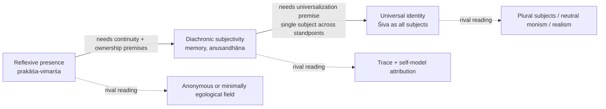
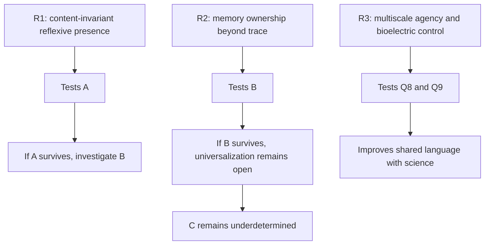

# Recognition Enquiry across Pratyabhijñā, Its Rivals, and Contemporary Consciousness Research

## Executive summary

[T][R] The strongest textually grounded core of the Recognition Enquiry is **A**, not **C**: Utpaladeva’s most defensible arguments establish that consciousness is intrinsically self-present or reflexive (*prakāśa–vimarśa*), that determinate cognition requires exclusion and synthesis, and that episodic memory presupposes more than a bare causal trace; they do **not** yield an uncontested proof that all finite subjects are numerically one universal subject. citeturn10view0turn10view1turn12view0turn12view2turn23search3turn23search4

[T][R] The decisive Utpaladevan materials for the present framework are: *ĪPK* 1.4.4–8 on memory and ownership, 1.5.11–14 on *vimarśa* and *svātantrya*, 1.6.3–8 on exclusion and finite ego-construction, 1.7.3–6 on synthesis and single-subject grounding, 2.4.14–19 on causal relation and the need for connective synthesis, plus *Ajaḍapramātṛsiddhi* 9–17 and 22–26 on why a non-reflexive light would be “crystal-like” and thus effectively inert. citeturn11view2turn10view0turn12view2turn12view0turn12view3turn9view0

[R][C] Bhartṛhari and the late *Sambandhasiddhi* trajectory sharpen the framework by showing that **relation**, **exclusion**, and **recognitive synthesis** are load-bearing; the best current scholarship reads Utpaladeva as arguing that relation is not an optional conceptual overlay but a pragmatic-transcendental requirement of intelligible judgment. citeturn20view0turn31view0turn32view2turn32view3

[R][X] Nyāya, Spanda, Krama, and Somānanda do not simply repeat Pratyabhijñā. Nyāya strengthens the enduring-self line without idealism; Spanda strengthens dynamism and invariant agency; Krama may offer a process-based nondual alternative to a “single static witness”; Somānanda appears stronger on divine identity than on the later phenomenology of recognition. Passage-level work on Udayana, *Mahānayaprakāśa*, and all four chapters of *Śivadṛṣṭi* still requires targeted translation or library access. citeturn36search1turn36search6turn24search0turn44search1turn44search2turn35view0

[E][C] The closest modern debate is **Zahavi-style reflexivism vs anonymism**, not IIT or predictive processing. Those latter programs are still useful, but mostly for bounded perspectivity, exclusion, and world-construction, not for proving universal identity. Levin’s multiscale agency and bioelectric research are highly relevant to the kañcuka-like architecture of finite agency; Seth is relevant to appearance, world-modeling, and perceptual presence; IIT is relevant to organizational identity claims; none of them presently discriminates **C**. citeturn41search5turn41search3turn42search1turn42search4turn43search8turn39search0turn40search7

[H][X] The decision-ready conclusion is: treat **A** as strongly grounded, **B** as plausible but still contested, and **C** as the live frontier. The next best moves are passage-first translation, not more ornamental formalism, and a modest empirical program centered on content-invariant reflexive presence, memory-ownership, and multiscale agency. citeturn23search3turn23search4turn38search4turn42search2

## Framework and method

[R] This report treats the Recognition Enquiry as an **analytic scaffold**, not as a completed formal calculus. That is the right correction in light of the strongest criticism of the prior framework: the notation is useful only if it tracks real argumentative dependencies rather than merely restating prose in symbols. citeturn23search3turn23search4turn38search4

[C] I will use the following status tags throughout:

| Tag | Use |
|---|---|
| **T** | directly attested in a primary text or critical edition |
| **R** | supported by peer-reviewed reconstruction / specialist scholarship |
| **E** | empirical finding or method claim from contemporary research |
| **C** | structured comparison across traditions or frameworks |
| **H** | hypothesis, research proposal, or inference beyond current proof |
| **X** | contested, weakly supported, unavailable online, or currently invalid |

[R] For this report, the framework’s twelve questions are best stated as a sequence from minimal phenomenology to maximal metaphysics:

| Question | Enquiry prompt |
|---|---|
| **Q1** | Does manifestation occur? |
| **Q2** | Is manifestation intrinsically self-present or merely lit for another? |
| **Q3** | How does determinacy arise: by exclusion, synthesis, or both? |
| **Q4** | What explains memory as *my* past experience rather than stored information? |
| **Q5** | What grounds relation, causal linkage, and practical judgment? |
| **Q6** | What, if anything, shows consciousness to be active or free (*svātantrya*)? |
| **Q7** | How are error, construction, and conceptuality possible without collapsing reality into fiction? |
| **Q8** | How do finite embodiment, bounded knowledge, and constrained power arise? |
| **Q9** | What is the best account of agency at organismic and sub-organismic scales? |
| **Q10** | What, if anything, justifies moving from local subjectivity to a universal subject? |
| **Q11** | What is recognition: new information, changed self-attribution, or ontological disclosure? |
| **Q12** | What observations, translations, or experiments could discriminate rival answers? |

[R][C] The three cumulative thesis-levels are then:

- **A**: reflexive presence  
- **B**: diachronic subjectivity and ownership  
- **C**: universal identity of finite subjects with a single divine consciousness  

[R][X] The crucial point is that **A does not automatically entail B, and B does not automatically entail C**. Each transition needs extra premises. That is faithful both to the texts and to the strongest modern critique of overreach. citeturn12view0turn23search3turn23search4

[T][R] The online source base used here is good for *ĪPK*, *Ajaḍapramātṛsiddhi*, *Spandakārikā*, *Vākyapadīya*, and *Tantrāloka*, because open searchable texts are available via GRETIL and Wisdomlib, and Muktabodha provides broad digital-library coverage for Kashmir Śaiva materials. It is weaker for *Ātmatattvaviveka*, *Mahānayaprakāśa*, and complete *Śivadṛṣṭi* passage extraction, where open searchable text was not retrieved in this search and print editions still matter. citeturn9view0turn9view1turn35view0turn19search4turn22search4turn24search1turn24search3turn36search1turn24search0turn44search1turn44search2

## Textual dossiers and extracted passages

### Availability and edition map

[T][R] The best currently retrievable online primary-text anchors are these:

| Corpus | Best retrieved online source | Editorial note | Present usability |
|---|---|---|---|
| *Ajaḍapramātṛsiddhi* | GRETIL HTML text | based on Kashmir Series 1921 edition | **High** citeturn9view0 |
| *Īśvarapratyabhijñākārikā* + *Vṛtti* | GRETIL HTML text | revised against Torella’s 1994 edition | **High** citeturn9view1 |
| *Spandakārikā* | GRETIL HTML text | searchable base text | **High** citeturn35view0 |
| *Spandakārikā* with Kṣemarāja | GRETIL mirror metadata retrieved | commentary confirmed online; full fetch unstable in this session | **Medium** citeturn17search1 |
| *Vākyapadīya* | GRETIL complete + Books I–III variants | searchable and indexed | **High** citeturn19search0turn19search1turn19search4 |
| *Tantrāloka* | Wisdomlib full Sanskrit text | based on Jun Takashima / GRETIL | **High** citeturn22search4 |
| *Sambandhasiddhi* | no reliable direct open text retrieved in-session; recent scholarship cites recent full translation | dossier must lean on recent specialist studies | **Medium** citeturn31view0turn32view2 |
| *Ātmatattvaviveka* | print editions and translations confirmed via metadata | searchable online passage not retrieved | **Low** citeturn36search0turn36search1turn36search6turn36search7 |
| *Śivadṛṣṭi* | authoritative modern translation exists in Nemec’s two volumes | full searchable online passage not retrieved | **Low** citeturn44search1turn44search2 |
| *Mahānayaprakāśa* | editions listed in Pandit; no open searchable text retrieved | frontier text for translation work | **Low** citeturn24search0 |

### Sample passages

[T] *ĪPK* 1.5.11–13 is the cleanest compact statement of *vimarśa*:

> **svabhāvam avabhāsasya vimarśaṃ vidur anyathā / prakāśo 'rthoparakto 'pi sphaṭikādijaḍopamaḥ**  
> “They know reflexive awareness to be the very nature of manifestation; otherwise manifestation, though tinged by objects, would be like a crystal—insentient.” citeturn10view0turn10view1

[T] *ĪPK* 1.4.4–6 is the core memory argument:

> **naiva hy anubhavo bhāti smṛtau pūrvo 'rthavat pṛthak / prāg anvabhūvam aham ity ātmārohaṇabhāsanāt**  
> “In memory, the prior experience does not appear apart like the past object; it appears as ‘I experienced [it] before,’ because it is displayed as mounted upon the self.” citeturn11view2

[T] *Ajaḍapramātṛsiddhi* 15–17 gives the anti-inert-light thesis in especially sharp form:

> **idam ity asya vicchinna-vimarśasya kṛtārthatā ... vimarśaḥ so 'ham ity ayam**  
> “The fulfillment of this segmented ‘this’-awareness is its resting in its own conscious nature … that reflexive awareness is ‘I am this.’” citeturn9view0

[T] *Tantrāloka* 5.62–63 helps show how Abhinavagupta radicalizes the same point:

> **prakāśasyātmaviśrāntāv aham ity eva dṛśyatām / anuttaravimarśe ...**  
> “When manifestation comes to rest in itself, it is seen precisely as ‘I’—in the unsurpassable reflexive awareness.” citeturn15search1turn15search4

[T] *Vākyapadīya* 2.143–145 is the key Bhartṛharian antecedent for holistic recognitive grasp:

> **vicchedagrahaṇe 'rthānāṃ pratibhānyaiva jāyate / vākyārtha iti tām āhuḥ**  
> “When segmented items are apprehended, what arises is a flash of understanding (*pratibhā*); that, they say, is sentence-meaning.” citeturn20view0

### Passage dossier table

[T][R] The following table is the operative core. It is intentionally selective: it includes the passages that actually bear on the Recognition Enquiry, not every famous verse.

| Source object | Claim object | Argument object | Explanandum object | Countermodel object | Verdict object |
|---|---|---|---|---|---|
| *ĪPK* 1.4.4–6 + *Vṛtti* citeturn11view2turn12view0 | [T] Memory presents a past experience as **mine**, not merely as reactivated content. | [T][R] Premise: in memory, previous experience appears under “I previously experienced this”; inference: a bare causal trace is insufficient for ownership. Suppressed premise: ownership cannot be generated entirely by present self-attribution. | [T] episodic memory and phenomenal ownership | [C] Buddhist *saṃskāra* + present attribution; [C] predictive self-modeling | [R] **Plausible**, not decisive. Strong for **B**; weaker against sophisticated constructivism. |
| *ĪPK* 1.5.11–14 + *Vṛtti* citeturn10view0turn10view1 | [T] Manifestation without *vimarśa* would be “crystal-like,” hence inert. | [T][R] Premise: what is merely clear but not self-apprehending lacks sentience; inference type: transcendental-phenomenological. | [T] what distinguishes consciousness from inert appearing | [C] anonymous luminosity; [C] higher-order or self-representational models | [R] **Established** for **A** inside the system; externally still contested. |
| *ĪPK* 1.6.3–8 + *Vṛtti* citeturn12view2 | [T] Exclusion (*apoha*) is constitutive of determinate judgment, including the empirical ego. | [T] “Ghaṭa” is formed by excluding non-pot; “I” under contraction is likewise a determinate construct. | [T] how finite identity and conceptual objects arise | [C] Nyāya realism about universals; [C] Buddhist apoha without reflexive subject | [R] **Strong** for Q3 and Q8; excellent bridge-text to science on restriction/exclusion. |
| *ĪPK* 1.7.3–6 + *Vṛtti* citeturn12view0turn12view1 | [T] Synchronization of temporally distinct cognitions requires a single knower. | [T][R] Premise: causality, contradiction, and memory require synthesis across discrete presentations; inference to *ekapramātṛ*. | [T] causal order, conflict resolution, unified cognition | [C] coordinated processes without enduring subject | [R][X] **Plausible** for **B**; not yet enough for **C**. |
| *ĪPK* 2.4.14–19 + *Vṛtti* citeturn12view3 | [T] Causal relation is unintelligible for entities lacking connective synthesis (*anusandhāna*). | [T] “When this exists, that exists” cannot belong to self-contained inert moments. | [T] relation, dependence, and causality | [C] Buddhist sequential causation; [C] formal causal models | [R] **Strong** as anti-eliminativism about relation; aligns with *Sambandhasiddhi*. |
| *Ajaḍapramātṛsiddhi* 9–10 citeturn9view0 | [T] Non-reflexive consciousness is no better than inert absence. | [T] if consciousness lacks *parāmarśa*, it cannot ground either itself or anything else. | [T] what makes the knower non-inert | [C] pure awareness without reflexivity | [R] **Established** for **A**. |
| *Ajaḍapramātṛsiddhi* 15–17, 22–26 citeturn9view0 | [T] Finite and infinite knower are the same consciousness under contraction and non-contraction. | [T] segmented “this” reaches completion in “I”; one same consciousness appears as limited and unlimited. | [T] relation between finite subject and supreme subject | [C] plural finite subjects; [C] neutral monism | [R][X] **Doctrinally central**, but universalization remains contested. |
| *Vākyapadīya* 1.1–4 citeturn20view1 | [T] Reality unfolds from beginningless *śabda-brahman*, one with multiple powers. | [T] ontological monism plus differentiated powers | [T] unity, multiplicity, and manifestation | [C] non-linguistic metaphysics; [C] atomism | [R] **Foundational antecedent** for Pratyabhijñā, not yet a recognition theory by itself. |
| *Vākyapadīya* 2.19, 2.143–152 citeturn20view2turn20view0turn20view4 | [T] Sequential utterance yields a non-sequential grasp; *pratibhā* is a holistic flash. | [T][R] sentence meaning is not compositional addition alone but synthetic illumination. | [T] unity-in-diversity, meaningful synthesis, immediate grasp | [C] strict compositionalism; [C] symbolic assembly models | [R] **Very strong** precursor for Q3/Q5/Q11. |
| *Sambandhasiddhi* as reconstructed by Berger/MacCracken citeturn31view0turn32view2turn32view3 | [R] Relation is not dispensable conceptual error; *vimarśa* is the locus of relational unity-in-diversity. | [R] pragmatic-transcendental argument: practical judgment already presupposes relation. | [R] relation, predication, and unity-in-diversity | [C] Dharmakīrtian eliminativism about relation | [R] **High-value frontier**; needs fresh direct translation for stronger T-status. |
| *Spandakārikā* 4–10, 13–18, III.16–19 citeturn35view0 | [T] The invariant agent persists across changing states; real power lies in interior dynamism (*spanda*). | [T] pleasure/pain cognitions presuppose a deeper continuity; loss belongs to activity-mode, not to the inner ground. | [T] continuity through states, agency, contraction, bondage | [C] strictly momentary consciousness; [C] static witness metaphysics | [R] **Strong support** for **A** and **B**; it weakens the need for a static substance model. |
| *Tantrāloka* 9.154, 183, 192, 203–205, 217–219, 10.108 citeturn21search3turn21search0turn21search1turn21search2turn15search2turn15search3turn22search0turn22search1turn22search2turn15search0 | [T] Māyā and the kañcukas articulate constrained agency, partial knowledge, desire, temporality, and situatedness. | [T] these are not accidental defects but structured contractions of consciousness into finite knowership. | [T] finite embodiment and organism-relative perspective | [C] pure illusionism; [C] crude “VR player outside the world” model | [R] **Essential** for Q8; Abhinava makes the contraction architecture unusually explicit. |

## Cross-tradition mapping

[R][C] The matrix below asks not “who agrees with whom in general?” but “which tradition most directly advances which question in the Recognition Enquiry?”

| Text / tradition | Q1–Q3 manifestation & determinacy | Q4–Q5 memory & relation | Q6 freedom / agency | Q8 finite contraction | Q10 universalization | A | B | C |
|---|---|---|---|---|---|---|---|---|
| Utpaladeva *ĪPK* | **High** citeturn10view0turn12view2 | **High** citeturn11view2turn12view3 | **High** citeturn10view1 | **Medium** citeturn12view2 | **Medium** citeturn12view0 | **High** | **High** | **Medium** |
| *Ajaḍapramātṛsiddhi* | **High** citeturn9view0 | **Medium** citeturn9view0 | **High** citeturn9view0 | **Medium** citeturn9view0 | **High** doctrinally, but contested philosophically citeturn9view0 | **High** | **Medium** | **Medium** |
| *Sambandhasiddhi* | **High** via relation/exclusion citeturn32view2turn32view3 | **High** citeturn32view2 | **Medium** citeturn31view0 | **Low** | **Medium** | **High** | **Medium** | **Low–Medium** |
| Bhartṛhari *Vākyapadīya* | **High** citeturn20view0turn20view2 | **Medium** | **Medium** citeturn20view1 | **Low** | **Medium** metaphysically | **Medium** | **Low** | **Low–Medium** |
| Spanda | **High** citeturn35view0 | **Medium** citeturn35view0 | **High** citeturn35view0 | **Medium** citeturn35view0 | **Low–Medium** | **High** | **High** | **Low–Medium** |
| Abhinavagupta *Tantrāloka* | **Medium** | **Medium** | **High** citeturn15search1turn15search4 | **High** citeturn15search2turn15search3turn15search0 | **High** doctrinally citeturn15search0 | **High** | **High** | **Medium** |
| Somānanda *Śivadṛṣṭi* | **Medium** | **Medium** | **High** | **Low** | **High** by stronger divine-identity framing | **Medium** | **Medium** | **Medium–High** doctrinally citeturn44search1turn44search2 |
| Nyāya / Udayana | **Low** for reflexivity | **High** for enduring self against momentariness | **Medium** | **Low** | **Low** | **Low** | **High** | **Low** citeturn36search1turn36search6 |
| Krama / *Mahānayaprakāśa* | **Medium** | **Medium** | **High** via processual sequencing | **Medium** | **Medium** | **Medium** | **Medium** | **Unknown** citeturn24search0 |

[R][X] The extra premises required at each transition are now quite clear:

| Transition | Premises still needed |
|---|---|
| **A → B** | [R] that reflexive presence is not momentary-only; [R] that memory ownership cannot be fully modeled by present attribution plus causal traces; [H] that synthesis implies subject-continuity rather than merely system-level coordination. |
| **B → C** | [X] that the best explanation of multiple finite subjects is one numerically identical subject; [X] that apparent plurality is modal self-differentiation rather than genuinely many subjects; [X] that nothing outside universal consciousness is needed to explain objectivity, intersubjectivity, and resistance. |

[R][C] This is where Abhinavagupta’s tattva and kañcuka discussions in *Tantrāloka* become important. They do not by themselves prove **C**, but they are the tradition’s best attempt to explain **how finite worlds can be real appearances of one consciousness without being mere illusion**. The five-fold (or six-fold, with Māyā) contraction architecture is therefore not an optional cosmological ornament; it is the explanatory bridge from universal freedom to finite perspective. citeturn15search2turn15search3turn21search3turn15search0

## Modern debates and empirical discriminators

[R][C] The most illuminating modern parallel is the dispute over whether experience is inherently “for-me” or fundamentally anonymous.

| Modern source | Claim object | Argument object | Explanandum | Countermodel | Verdict |
|---|---|---|---|---|---|
| Zahavi / minimal self | [R] experience has irreducible first-personal character; self is not merely narrative or socially constructed. citeturn41search5 | [R] phenomenological analysis of subjectivity | first-person givenness | anonymism; narrative constructivism | **Strong parallel to A**, not to C |
| anonymist / anonymity line | [R] self-other difference may arise from more primitive anonymity; pre-reflective awareness need not already imply a robust subject. citeturn41search3 | [R] phenomenological and social-ontological critique | whether “for-me-ness” entails an egological self | strong reflexivism | **Best live rival to A** |
| Varela neurophenomenology | [R][E] consciousness research should mutually constrain first-person and third-person data. citeturn38search1turn38search4 | [R] methodological, not metaphysical | how to study lived structures rigorously | purely third-person neuroscience | **Essential method for Q12** |
| Josipovic nondual-awareness program | [E][H] some contemplative reports indicate content-invariant reflexivity or “awareness of awareness.” citeturn37search0turn37search1 | [E] phenomenology-guided neuroscience | explicit reflexive awareness across varying contents | representational accounts only | **Interesting for A; weak for C** |
| Levin multiscale agency / bioelectricity | [E][C] agency, memory, and top-down control can be distributed across multicellular systems and not restricted to brains. citeturn42search1turn42search4turn43search8turn43search3 | [E] developmental and systems biology | how bounded agents and world-relative goals arise | neuron-centrism; one-scale agency | **Very strong for Q8/Q9; neutral on C** |
| thoughtforms.life / “thoughts and thinkers” | [H] thinker/thought and body/memory boundaries may be complementary rather than absolute. citeturn7search0turn8search2 | [H] speculative extension | nested agency and self-model boundaries | strict unitary agent model | **Useful heuristic only** |
| Seth predictive processing | [R][E] perceptual presence reflects predictive modeling and counterfactual richness. citeturn39search0turn39search2turn39search4 | [R] computational neuroscience | how world-presence is constructed under perspective | naive realism; simple hallucination language | **Strong for Maya-like world-structuring, not for C** |
| IIT / Tononi / Albantakis | [R] consciousness corresponds to integrated irreducible causal structure; IIT begins from phenomenological axioms. citeturn40search4turn40search7 | [R] formal identity claim between experience and integrated mechanism | organizational conditions for consciousness | reductive functionalism; pure behaviorism | **Best modern comparator for identity claims, but not divine universalization** |
| Tegmark perceptronium | [H][C] consciousness is a state of matter with informational/integration properties. citeturn39academia44turn39academia45 | [H] highly speculative physical generalization | physical realization conditions | biological exceptionalism | **Comparatively weak for the current enquiry** |

[R][C] The most important comparative conclusion is simple: **science can presently speak most clearly to bounded perspectivity, relation, exclusion, and multiscale agency; it speaks much less clearly to universal identity**. That means the framework should not try to force a spurious symmetry between current empirical theories and Pratyabhijñā’s final metaphysical move. citeturn42search1turn39search0turn40search7turn23search4

### Discriminating predictions

[E][H] The most useful near-term tests are these:

| Test label | Target thesis | Prediction | What would count against it |
|---|---|---|---|
| **R1** | **A** | [E][H] trained subjects should report a content-invariant reflexive “for-me-ness” or awareness-presence across perception, imagery, affect, and reduced-thought states. citeturn37search0turn38search4 | [E][X] if careful phenomenology consistently finds only content-specific constructions and no stable reflexive invariant |
| **R2** | **B** | [H] episodic memory ownership should not reduce fully to causal trace plus present labeling; manipulations that preserve content while disrupting ownership should expose a dissociation. | [E][X] if ownership is fully predictable from trace-strength, narrative context, and self-model variables alone |
| **R3** | **Q8/Q9** | [E] bioelectric and multicellular perturbations should alter system-level goals, morphology, and “problem-solving” in ways better modeled as distributed agency than as gene-only execution. citeturn42search1turn42search4turn43search0turn43search3 | [E][X] if gene-expression and local chemistry alone explain the same outcomes with no added explanatory gain from multiscale agency |
| **R4** | **C** | [X] there is currently no settled empirical discriminator between one universal subject and many local subjects. | [X] This remains primarily philosophical / phenomenological, not experimentally adjudicated. |

## Gaps, adjudication points, and the one-page research agenda

### Gaps that genuinely matter

[R][X] The main unresolved points are not marginal; they are exactly the places where specialists are most likely to push back.

| Gap | Why it matters | Best textual adjudicator | Best empirical adjudicator |
|---|---|---|---|
| **epistemic-to-ontological slide** | [X] “all reality is accessible only through consciousness” does not entail “all reality is nothing but consciousness.” | Ratié on otherness and idealism; *ĪPK* 1.5–1.6 and relevant *ĪPVV* materials citeturn23search2turn23search4 | none direct |
| **memory argument strength** | [X] trace theories may explain ownership more than Utpaladeva allows | Torella + *ĪPK* 1.4, 1.7 citeturn11view2turn12view0turn23search7 | R2-style episodic-ownership experiments |
| **universalization from one knower to one universal subject** | [X] even a single knower per stream does not prove one knower across all streams | *Ajaḍapramātṛsiddhi* 16–18, *Tantrāloka* tattva/kañcuka chapters citeturn9view0turn15search2turn15search3 | none direct |
| **status of relation** | [R] if relation is only conceptual fiction, much of the framework collapses | *Sambandhasiddhi* + Bhartṛhari *Vākyapadīya* III.3 citeturn31view0turn32view2turn32view3 | indirect only |
| **process vs witness ontology** | [X] Krama and Spanda may explain continuity without a static witness-substance | *Spandakārikā* and *Mahānayaprakāśa* | dynamical-system analogies, not direct tests |

### Decision-ready research agenda

[R][H] If this were being circulated to specialists tomorrow, I would propose the following priority order.

| Priority | Passage-set / text | Why first | Specific question for translators / commentators |
|---|---|---|---|
| **Immediate** | *ĪPK* 1.4, 1.5, 1.6, 1.7; *Ajaḍapramātṛsiddhi* 9–17, 22–26 | already the strongest core of the framework | “What is the weakest defensible reading of *vimarśa* that still preserves the argument?” |
| **Immediate** | *Tantrāloka* 5.62–63; 9.154–205; 10.108 | best articulation of contraction / kañcukas | “Are the kañcukas explanatory constraints, ontic layers, ritual categories, or all three?” |
| **Immediate** | *Vākyapadīya* 2.19, 2.143–152 and III.3 *Sambandhasamuddeśa* | clarifies synthesis, *pratibhā*, relation | “How far can Bhartṛhari’s holism be taken without importing Śaiva idealism?” |
| **High** | *Sambandhasiddhi* complete | likely the best underused bridge-text for relation, exclusion, and judgment | “Does Utpala offer a retorsive/transcendental argument, or only a pragmatic indispensability argument?” |
| **High** | *Spandakārikā* with Kṣemarāja + Kallaṭa | strongest non-static account of continuity and agency | “Does Spanda support recognition without presupposing a substance-self?” |
| **High** | *Ātmatattvaviveka* selected anti-momentariness sections | best realist rival on enduring self | “Which of Udayana’s anti-Buddhist moves survive without Nyāya realism about external objects?” |
| **Medium** | *Śivadṛṣṭi* key recognition and anti-grammatical sections | identifies what is pre-Utpala and what is later refinement | “Which recognition claims are already in Somānanda, and which are Utpaladeva’s innovations?” |
| **Medium** | *Mahānayaprakāśa* phase-sequence passages | possible process-based corrective to witness metaphysics | “Can Krama yield A and B without Utpala’s stronger C-claim?” |

[R][H] The specific deliverables for the next cycle should be equally concrete:

- [H] **Deliverable one:** a passage-book of 50–70 verses with Sanskrit, literal gloss, polished translation, and argumentative annotation, limited to the texts above.  
- [H] **Deliverable two:** a separate short paper titled *What Recognition Is Not*, excluding three common confusions: new information, ego inflation, and mere belief revision.  
- [H] **Deliverable three:** a methods memo for R1–R3 experiments, co-written with a phenomenologist and a cognitive scientist, using Varela/Lutz-style neurophenomenology rather than generic meditation studies. citeturn38search1turn38search4turn37search0

### What can be said right now with confidence

[T][R] The following are the secure conclusions of the present checkpoint:

- [T][R] **Recognition is not primarily the acquisition of new propositional content.** It is a shift in self-attribution or self-scoping over content already present. The memory and recognition examples in Utpaladeva support exactly that reading. citeturn11view2turn12view2
- [T][R] **Vimarśa is not “anything that appears.”** It is the reflexive, self-grasping or self-articulating character without which manifestation would be merely crystal-like and inert. citeturn10view0turn9view0
- [T][R] **Exclusion is load-bearing.** Finite ego, objecthood, and determinate judgment are all articulated through exclusion, not just through lack of information. citeturn12view2
- [T][R] **Finite limitation is not yet bondage.** Abhinavagupta’s contraction materials support the distinction between bounded perspective and false absolutization of that perspective. citeturn15search2turn15search3turn15search0
- [E][C] **Science can already speak the language of contraction surprisingly well** in domains of bounded agency, partial observability, multiscale control, and world-model construction. Levin and Seth are the strongest current bridges here. citeturn42search1turn42search4turn43search8turn39search0
- [X] **The one-subject universalization remains the frontier.** It is the live metaphysical wager, not a theorem currently enforced by either text-critical scholarship or contemporary science. citeturn23search4turn37search1

## Conclusion

[R] The Recognition Enquiry is now sharp enough to function as a real research program rather than a display piece. Its proven core is:

- [T][R] **A:** consciousness is intrinsically reflexive rather than merely illuminated for another;  
- [T][R] **B:** memory, relation, and synthesis provide serious pressure toward diachronic subjectivity and ownership;  
- [X] **C:** the further claim that all finite subjects are one universal subject remains philosophically ambitious, textually central to Pratyabhijñā, and still underdetermined. citeturn10view1turn12view0turn12view3turn23search4

[R][C] So the correct “same language” framework is not: “science proves Abhinavagupta,” nor: “Abhinavagupta only restates self-organization.” It is this: **Pratyabhijñā offers a layered explanatory architecture of manifestation, exclusion, relation, agency, and contraction; modern science can test and refine large parts of that architecture up to A and parts of B, but not yet C.** citeturn12view2turn32view2turn42search1turn39search0turn40search7

[H] That is the right seed-framework to take to Pratyabhijñā, Nyāya, Spanda, Krama, Bhartṛhari, and modern consciousness science alike: one framework, openly stratified by proof-strength, with the frontier clearly marked rather than smuggled in.